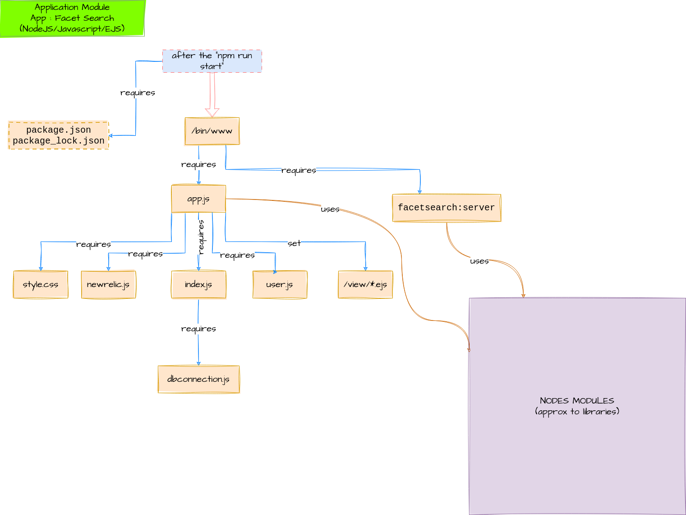
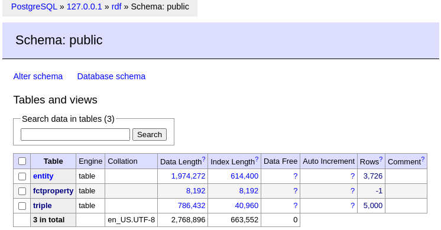
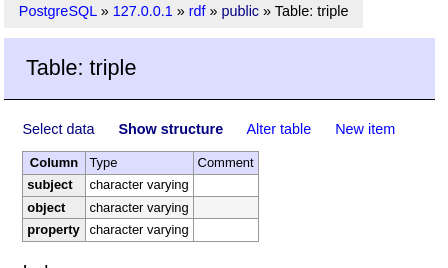
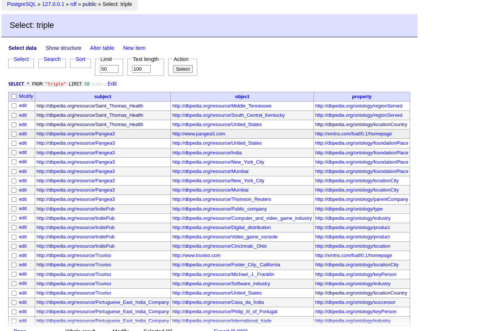
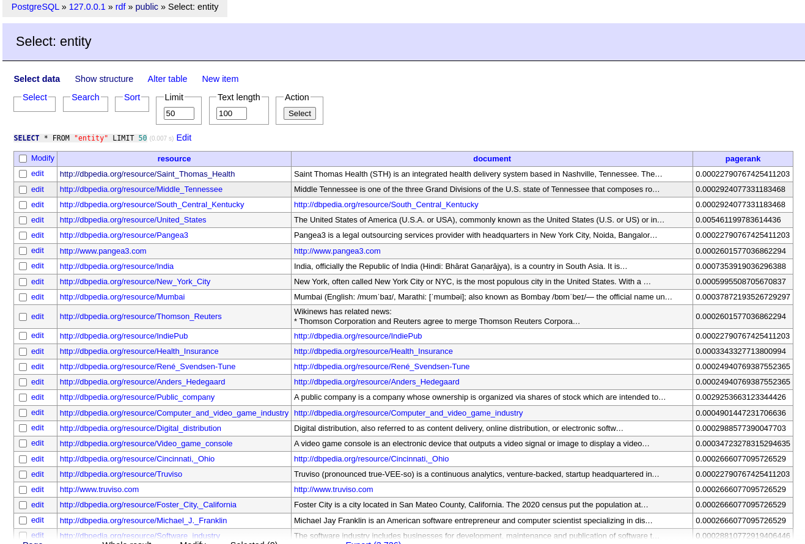
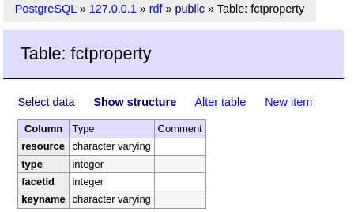
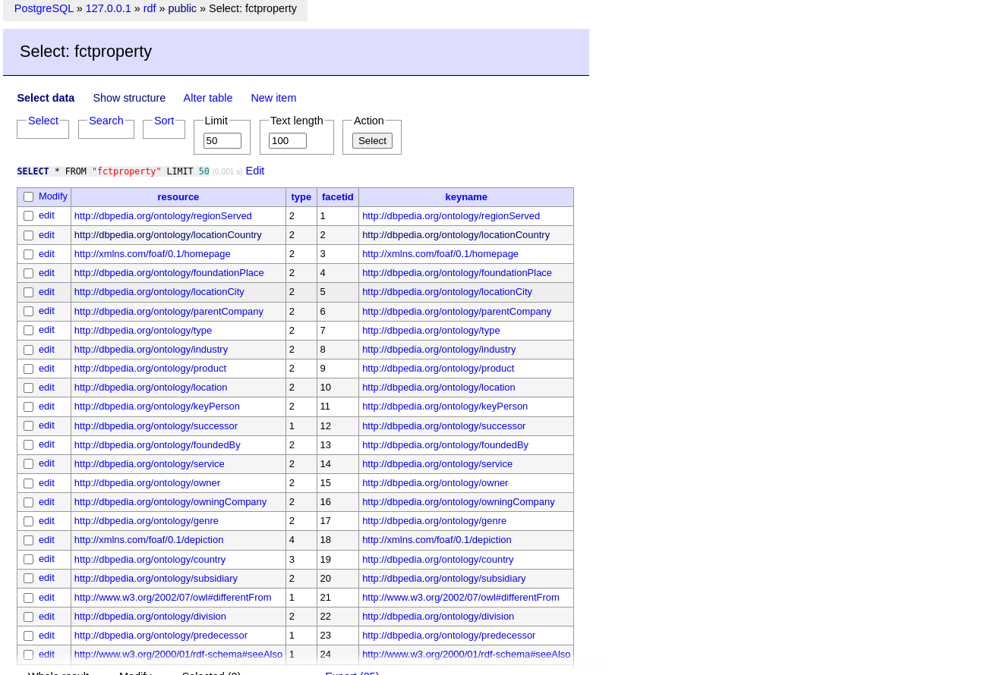
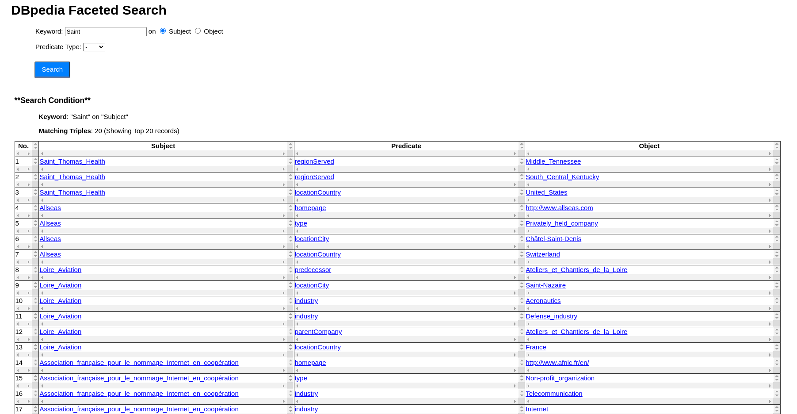
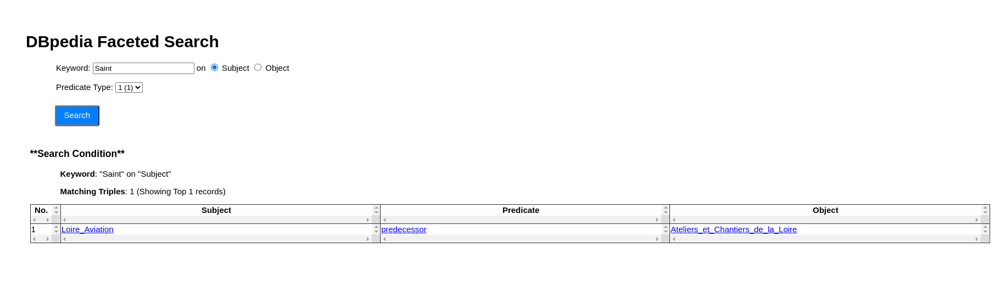

# **ABOUT APPLICATION CODE**

## **Introduction**

The following description are related to the application code files, alongside with configuration files and scripts.

## **Modelisation on how the files are linked**
\


### **Creation on a local database with PostGreSQL**

Asthe project had been handled so far, it needs to create a blank database on a personal machine with PostGreSQL to use with the facet search.
Followed those tutorial links for settting all things up or refer to section III (useful links used): 
- https://www.digitalocean.com/community/tutorials/how-to-install-and-use-postgresql-on-ubuntu-20-04
- https://ubuntu.com/server/docs/databases-postgresql

Some advises from chatGPT : \
You can replace "myuser" and "mypassword" with the username and password of your choice :
```SQL
CREATE USER myuser WITH PASSWORD 'mypassword';
```
After creating the user, you can use the following command to create a new PostgreSQL database : 
```SQL
CREATE DATABASE mydatabase OWNER myuser;
```

Then it is needed to create a `.env` file (which is not push into the git, reffers to the `.gitignore`) structured as below and stored in the same path as ```dbconection.js``` (into `~facetedsearchsystem-work`):
```bash
DB_HOST=localhost
DB_PORT=5432
DB_DATABASE=name_of_my_database
DB_USER=my_DB_username
DB_PASSWORD=my_DB_password
```

To manage the database created loccally, a tool named **Adminer** had been installed (but any other tool to manage easily a databse is fine, it depends on what you want/need and are comfortable with).\
Once Adminer instaled, start it by entering this url in my navigator : http://localhost/adminer.\
I connect to it once in PSQL via :
```psql
your_session=# \c <name_ofthe_database>
```
**<span style="color: green;">
It is possible to manage the database either with tools like Adminer (way more easier) or with commands in the terminal.
</span>**


**TO COPY A *.csv* INTO A TABLE**\
This link the one that had been used : https://www.postgresqltutorial.com/postgresql-tutorial/import-csv-file-into-posgresql-table/

## **Database Schema**
The database contains three tables, which are created from CSVs in output directory, as follows:
\

\
This is the schema for each created table.
\

\

\

\

\

\


### **Commands and scripts to execute the application**
\
In ``~/facetsearchsystem-work``, do think to run the following commands to start the ProFacet :

```bash
cd [WORKING_DIRECTORY]  #where the files package.json nad package-lock.json are
npm i -y                   #installed all the modules needed to run your Javascript
```

```bash
npm run start 
```
Then enter `http://localhost:4000` on your navigator

### ScreenShots of the Application
# Keyword Search
 
# Selecting Cluster 1



## **Useful links** :
 - https://linuxhint.com/install-adminer-ubuntu/
 - https://www.digitalocean.com/community/tutorials/how-to-install-postgresql-on-ubuntu-22-04-quickstart
 - https://phoenixnap.com/kb/postgresql-drop-database
 - https://www.cherryservers.com/blog/how-to-install-and-setup-postgresql-server-on-ubuntu-20-04
